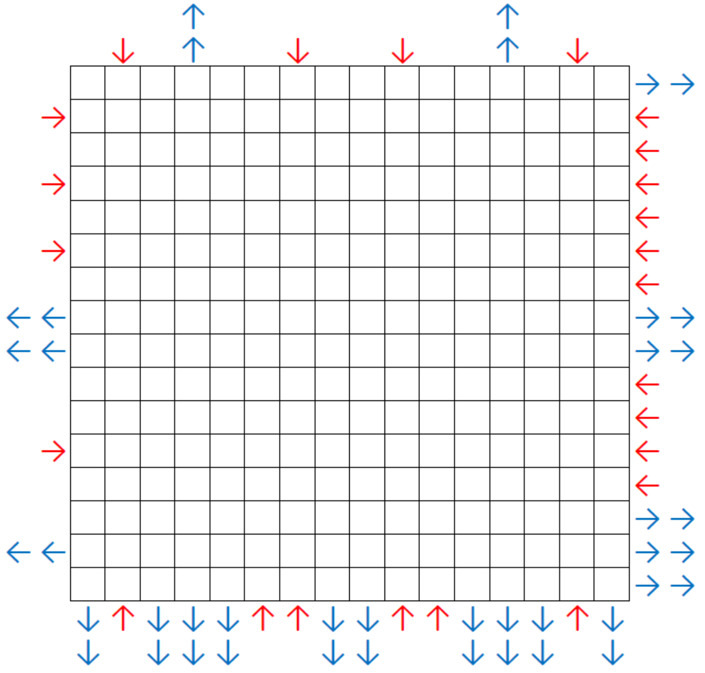

# Hall of Mirrors - April 2015

**Category:** Grid Puzzle
**URL:** https://www.janestreet.com/puzzles/hall-of-mirrors-index/

## Problem Statement

Alongside the grid above there are several arrows. Red arrows indicate a laser being shone in the given direction, from just off the edge of the grid. Blue arrows indicate a goal. Your job is to add diagonal mirrors to the grid so that as many lasers reach their goal as possible. A mirror cuts across one or more cells at a 45-degree angle (a cell can contain at most one mirror).

You receive **5 points** for every incoming laser that gets redirected to a goal, and you lose **(N+2) points** for every mirror you install, where N is the length of the mirror. (Mirrors may cross over each other. E.g. you could have an "X" shape using two length-2 mirrors, which would count as two length-2 mirrors and not as one length-4 mirror.)

**What's the highest score you can achieve?**

**Image:**

