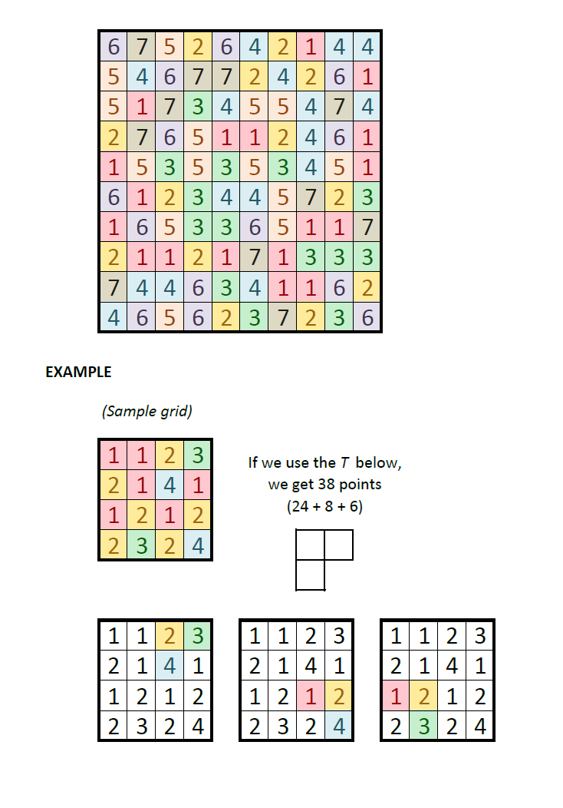

# Polymath - June 2015

**Category:** Grid Puzzle / Optimization
**URL:** https://www.janestreet.com/puzzles/polymath-index/

## Problem Statement

Choose an *n*-omino (call it T) and place as many copies of it as you can on the 10-by-10 board above.

- An *n*-omino is a connected region of *n* cells. You get to choose *n*.
- Rotations and reflections of T are allowed.
- Copies of T may not overlap with each other.
- Any given copy of T may not be placed over two cells of the same value.
- The score for each copy of T is the product of the cells it covers.
- Your total score is the sum of the scores for your T's.

What's the highest total score you can get?

Submit your score as your answer, and send us a picture of your solution at polymath-puzzle@janestreet.com

**Image:**

