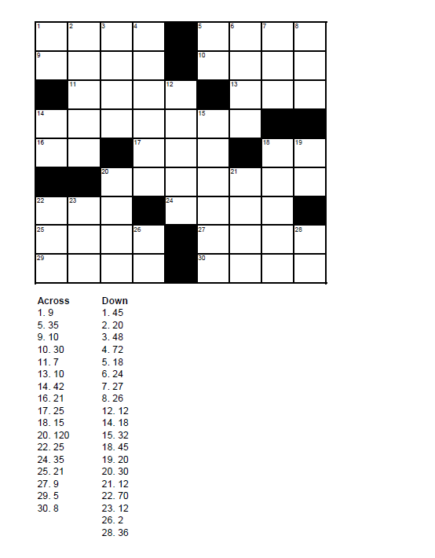

# Number Cross 2 - August 2015

**Category:** Grid Puzzle
**URL:** https://www.janestreet.com/puzzles/number-cross-2-index/

## Problem Statement

Fill the cells in this crossword with the digits 1 through 9 (no zeroes). Each clue in this crossword represents either the sum of the digits or the product of the digits in its corresponding answer — it's up to you to decide which. The clue could potentially represent both the sum and the product, if the sum and product are the same. Digits can be repeated within an answer, and answers can be repeated in the grid.

As your answer, submit the sum of all of the digits you entered into the completed grid.

**Image:**

