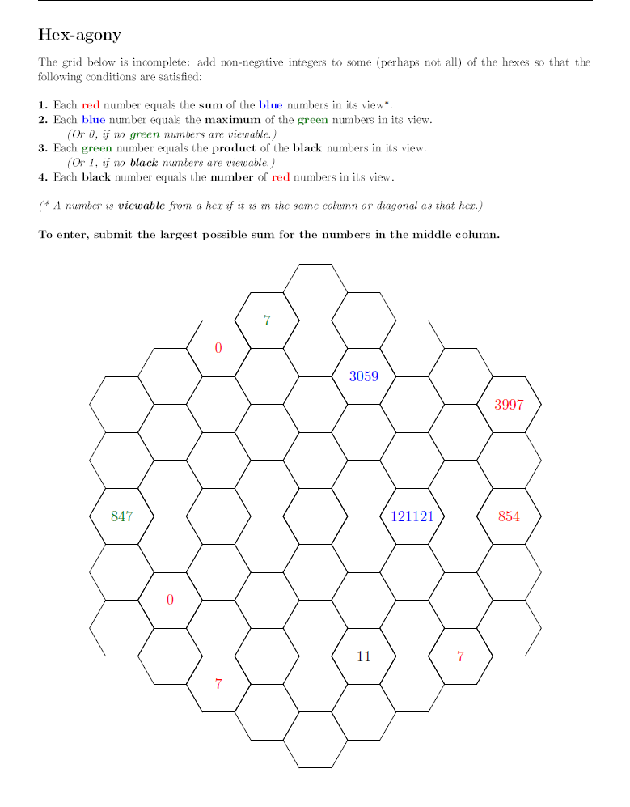

# Hex-agony - October 2015

**Category:** Grid Puzzle
**URL:** https://www.janestreet.com/puzzles/hex-agony-index/

## Problem Statement

The grid below is incomplete: add non-negative integers to some (perhaps not all) of the hexes so that the following conditions are satisfied:

1. Each **red** number equals the **sum** of the **blue** numbers in its view.
2. Each **blue** number equals the **maximum** of the **green** numbers in its view. *(Or 0, if no green numbers are viewable.)*
3. Each **green** number equals the **product** of the **black** numbers in its view. *(Or 1, if no black numbers are viewable.)*
4. Each **black** number equals the **number** of **red** numbers in its view.

*A number is **viewable** from a hex if it is in the same column or diagonal as that hex.*

To enter, submit the largest possible sum for the numbers in the middle column.

**Image:**

