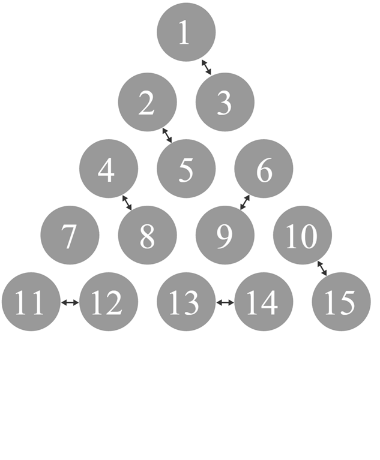

# Pair Dance - November 2015

**Category:** Combinatorics
**URL:** https://www.janestreet.com/puzzles/pair-dance-index/

## Problem Statement

15 dancers are standing in an equilateral triangle formation, with every dancer standing 1 unit apart from her nearest neighbors. Each dancer chooses another who is 1 unit away to pair up with, and all but 1 dancer ends up as a part of a pair. An example of one such arrangement is presented here.

How many different sets of 7 pairs are possible?

**Image:**

