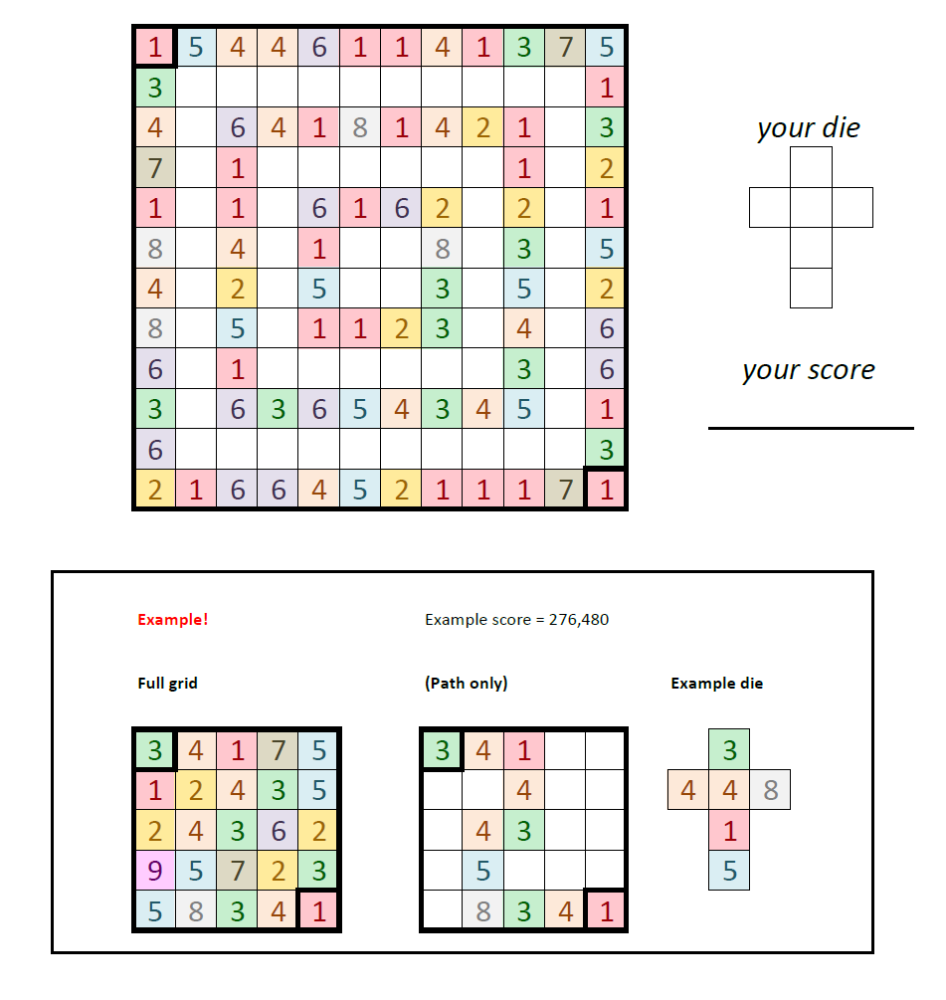

# Travel Agent - February 2016

**Category:** Grid Puzzle / Dice Rolling
**URL:** https://www.janestreet.com/puzzles/travel-agent-index/

## Problem Statement

You have a standard die with faces numbered 1-6, but YOU get to choose the arrangement. Choose how to label your die, then roll it through the grid starting from the top-left corner and ending at the bottom-right corner.

The grid contains numbers in colored cells. As you roll the die through the grid, you travel a path. Your score is calculated based on the path you take and the die face values that touch each cell.

The example shows a 5x5 grid with a path scoring 276,480.

Your goal is to find the die configuration and path through the larger grid that maximizes your score.

**Image:**

