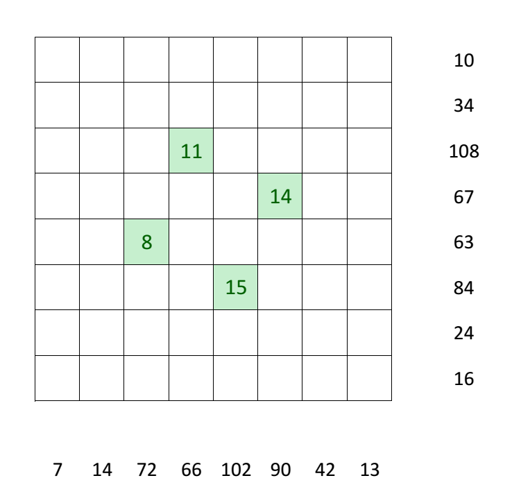

# Knight Moves - March 2016

**Category:** Grid Puzzle
**URL:** https://www.janestreet.com/puzzles/knight-moves-index/

## Problem Statement

A knight was alone on a chessboard. It started on a square and marked it "1", then moved to a square and marked it "2", then moved to a square and marked it "3", and so on, each time making legal knight's moves, and never revisiting a square. Some of the squares it visited are marked on the chessboard presented here.

The knight stopped on his 28th square, at which point the 28 visited squares formed a picture with spiral symmetry (90 degree rotational symmetry).

The numbers along the sides of the 8 rows and 8 columns are the sums of the numbers of the squares visited by the knight in that row/column.

The answer to this month's puzzle is the largest product of the numbers in any one row or column.

**Image:**

