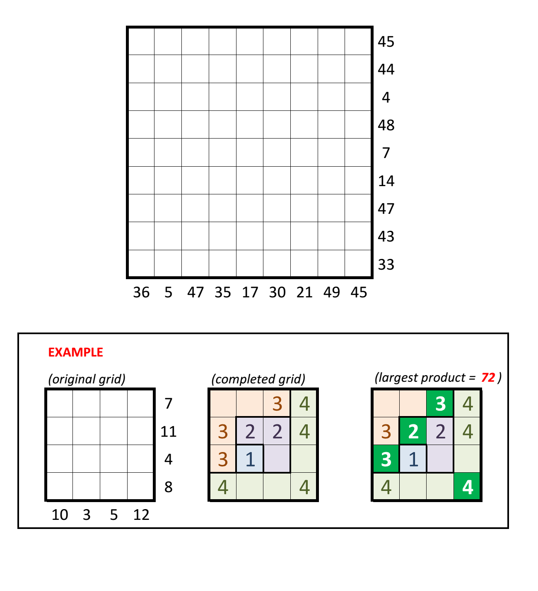

# Hooks #2 - May 2016

**Category:** Grid Puzzle
**URL:** https://www.janestreet.com/puzzles/hooks-2-index/

## Problem Statement

The grid below can be partitioned into 9 L-shaped "hooks". The largest is 9-by-9 (contains 17 squares), the next largest is 8-by-8 (contains 15 squares), and so on. The smallest hook is just a single square.

Find where the hooks are located, and place nine 9's in the largest hook, eight 8's in the next-largest, etc., down to one 1 in the smallest hook.

The goal is for the sum of the numbers in each row and column to match the number given outside the grid.

As your answer to this puzzle, submit the largest product one can achieve using a subset of the numbered squares in the completed grid, satisfying the condition that no two squares in the subset are in the same row or column.

**Image:**

