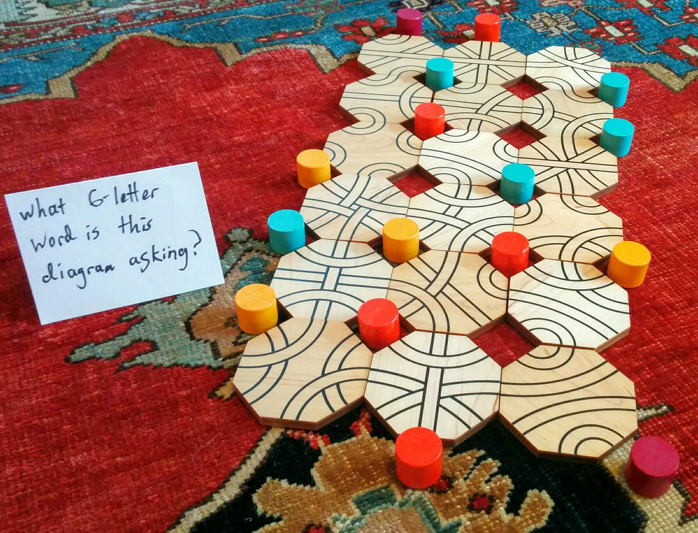

# Number Cross #3 - July 2016

**Category:** Grid Puzzle
**URL:** https://www.janestreet.com/puzzles/number-cross-3-index/

## Problem Statement

Enter the digits 1 thru 9, or their negatives, in each of the squares in the crossword grid. The crossword clues represent the sum of the digits in each answer. Ignoring sign, no digit will appear more than once in any row or column in the completed grid. Also, every row and column of the completed grid has exactly one negative number.

For your answer, submit the sum of all numbers in the grid which share a border (horizontal or vertical) with one of the negative numbers.

**Image:**

