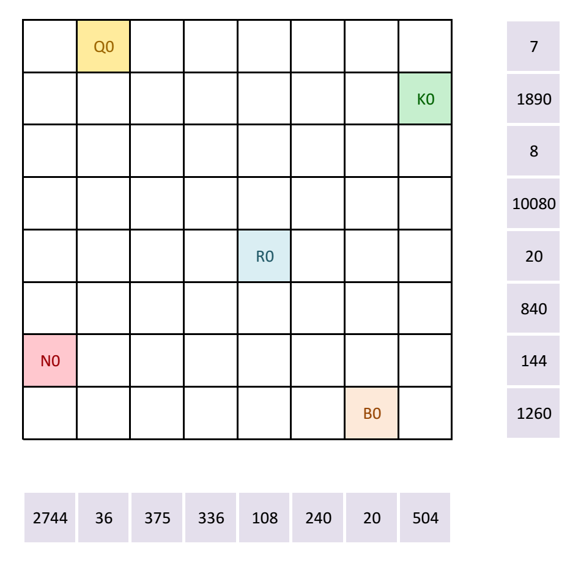

# Chess Dance - September 2016

**Category:** Grid Puzzle
**URL:** https://www.janestreet.com/puzzles/chess-dance-index/

## Problem Statement

Five chess pieces are placed on a chessboard: a **Q**ueen, **K**ing, **R**ook, **B**ishop, and k**N**ight, as shown.

They all move simultaneously, and finish at squares that we'll label Q1, K1, B1, R1, and N1. They continue moving, and no square is ever visited more than once, for a total of **8 moves**. (So in total, 45 squares will be labeled: Q0 through Q8, K0 through K8, etc.)

Pieces move according to the same rules as chess (e.g. a Rook can move anywhere along its row or column). After each move, no piece is allowed to be under attack from any other piece.

The numbers along the rows and columns presented here are the products of the non-zero numbers that were visible after **only 7 moves**.

After all 8 moves are finished, the 8 row products and the 8 column products are recalculated (non-zero numbers only).

The answer to this month's puzzle is the largest possible sum for these 16 products.

**Image:**

