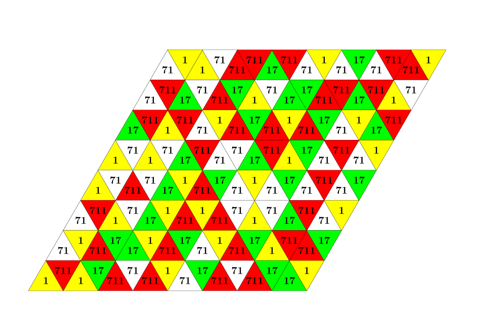

# Tri, Tri Again - October 2016

**Category:** Grid Puzzle
**URL:** https://www.janestreet.com/puzzles/tri-tri-again-index/

## Problem Statement

Label the sides of a tetrahedron with 1, 17, 71, and 711. On the board presented here, place the tetrahedron on one of the top 8 triangles, and roll it until it reaches one of the bottom 8 triangles, such that whenever the tetrahedron is touching the board (including its initial placement), the number on its base equals the number on the board. What is the lowest possible sum of numbers that your tetrahedron encounters?

**Image:**

