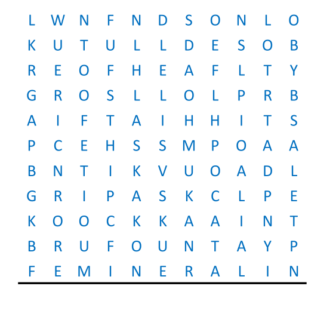

# The Wright Stuff - November 2016

**Category:** Visual Puzzle
**URL:** https://www.janestreet.com/puzzles/the-wright-stuff-index/

## Problem Statement

The answer to this puzzle, which comprises 11 letters, is on the National Register of Historic Places.

**Hints from Jane Street:**
- *Update Nov 14th:* Yikes! This puzzle hasn't fallen for anyone yet. The gravity of the situation is not yet too extreme, so we'll just drop this hint here: some parts of this puzzle may evaporate.
- *Update Nov 23rd:* Another hint — if you've solved this puzzle, you will have used each letter exactly once, in one way or another.

**Image:**

