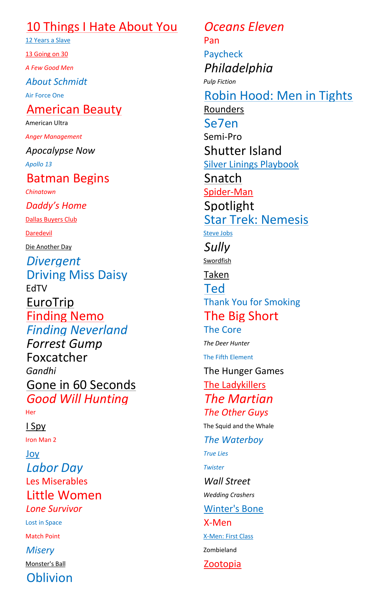

# Star Search - December 2016

**Category:** Visual Puzzle / Meta Puzzle
**URL:** https://www.janestreet.com/puzzles/star-search-index/

## Problem Statement

The image shows a list of movie titles displayed with different formatting: varying colors (red, blue, black), fonts (italic, bold, regular), sizes, and styles (underlined, etc.).

The visual properties of each movie title encode information that leads to the answer.

**The answer to this month's puzzle is a movie.**

**Image:**

