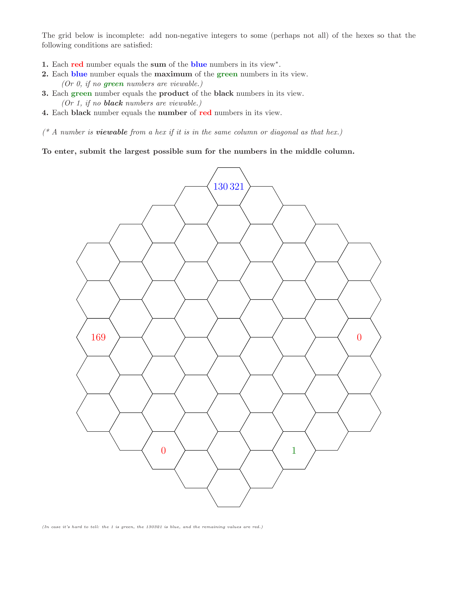

# Hex-agony 2 - January 2017

**Category:** Grid Puzzle
**URL:** https://www.janestreet.com/puzzles/hex-agony-2-index/

## Problem Statement

A hexagonal grid puzzle involving number placement.

**Answer:** Find the largest possible sum for the numbers in the middle column of the hexagonal grid.

**Image:**

