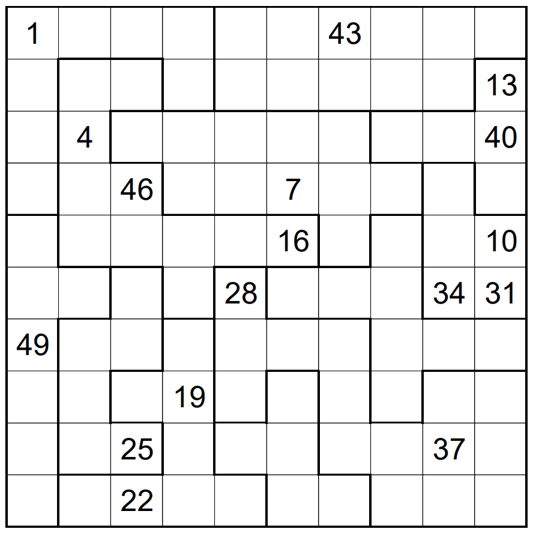

# Knight Moves 2 - April 2017

**Category:** Grid Puzzle
**URL:** https://www.janestreet.com/puzzles/knight-moves-2-index/

## Problem Statement

A knight is initially located in the grid on the square marked 1. It then proceeds to make a series of moves, never re-visiting a square, and always changing region on each move. Each row and column is visited the same number of times, as is each region.

Fill in the missing steps from the knight's journey.

**Answer:** The product of the areas of the orthogonally connected groups of empty squares in the completed grid.

**Image:**

