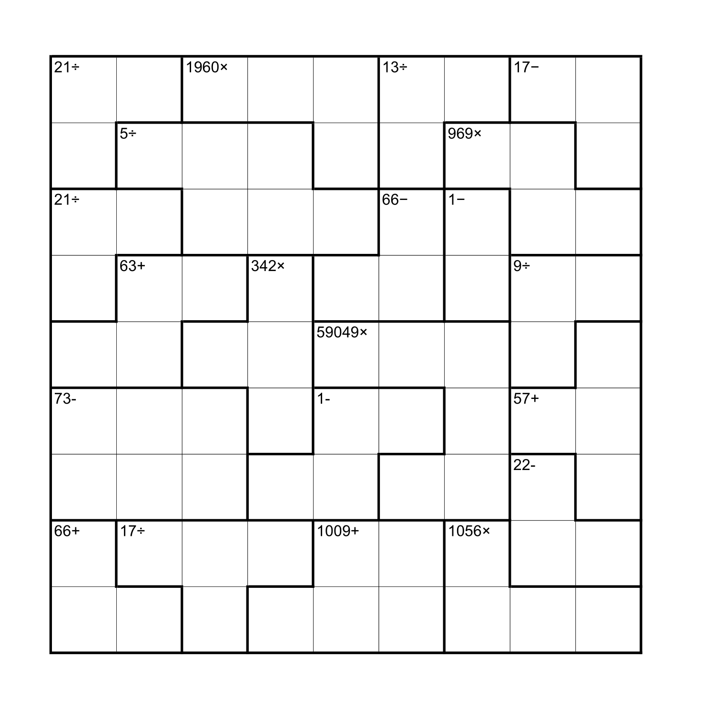

# KenKen (Concatenated) - May 2017

**Category:** Grid Puzzle
**URL:** https://www.janestreet.com/puzzles/kenken-concatenated-index/

## Problem Statement

A variant of KenKen: fill each cell with a digit between 1 and 9 so that each row and column contains each digit once. Like a normal KenKen puzzle, the numbers within each region should form the indicated amount under the given operation. However, when calculating, horizontally adjacent cells within a region should be concatenated to form a single number. (E.g., a 2 next to a 3 would become a 23).

The answer to this month's puzzle is the sum of the largest number in each region. (Still using concatenation: the largest number in a region may comprise 1, 2, or 3 digits.)

**Image:**

