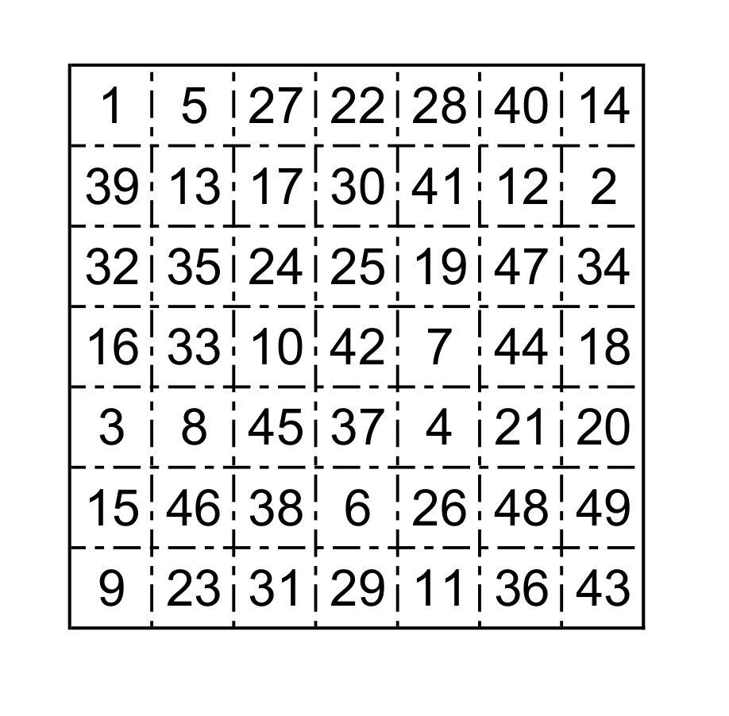

# Well Well Well... - June 2017

**Category:** Logic / Simulation
**URL:** https://www.janestreet.com/puzzles/well-well-well-index/

## Problem Statement

A 7′-by-7′ well is dug. It has a peculiar shape: its depth varies from one 1′-by-1′ section to another, as shown below. Each section is marked with its depth. (E.g., the deepest section is 49′ deep.)

Water is poured into the well from a point above the section marked 1, at a rate of 1 cubic foot per minute. Assume that water entering a region of constant depth immediately disperses to any orthogonally adjacent lower-depth regions evenly along its exposed perimeter.

After how many minutes will the water level on section 43 begin to rise?

**Image:**

