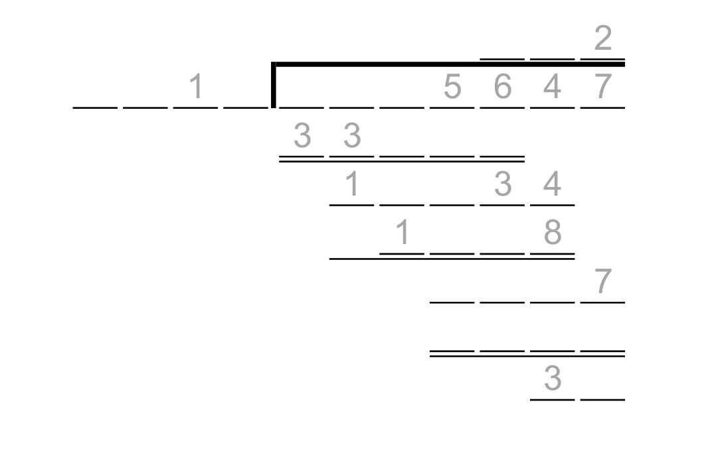

# Split Division - July 2017

**Category:** Number Puzzle
**URL:** https://www.janestreet.com/puzzles/split-division-index/

## Problem Statement

Two long division problems were calculated, and both problems had the exact same shape. At some spots, both problems had positive digits, one of which divides evenly into the other. All of those spots are marked below with their respective quotients.

The answer to this month's puzzle is the sum of the two 7-digit dividends in the completed long division problems.

**Image:**

