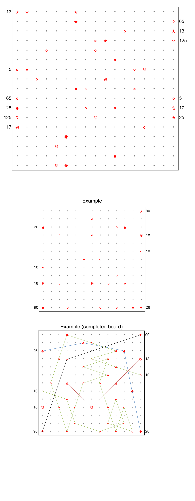

# Middlylinks - August 2017

**Category:** Grid Puzzle / Logic
**URL:** https://www.janestreet.com/puzzles/middlylinks-index/

## Problem Statement

Draw a linked path from the symbols beside each number on the lefthand side of the grid to the symbols beside the same number on the right. Links are line segments whose endpoints are dots (or symbols) on the grid below. A number N beside a symbol indicates the square of the length of each link in its path. Two links from different paths may only intersect (cross or touch) at their midpoints. Paths may not pass through a dot or symbol more than once.

Some of the other dots have been replaced by link symbols (star, circle, diamond, spade, heart, "at" sign) as clues. The appropriate path must make a stop at each point which is already labeled with a symbol.

The answer to this month's puzzle is the value of N(5)×N(13)×N(17)×N(25)×N(65)×N(125), where N(k) is the number of links in the path for k in the completed grid.

A smaller example puzzle is presented below as well for context. On that completed board, N(10) = 26, N(18) = 4, N(26) = 4, and N(90) = 2.

**Image:**

