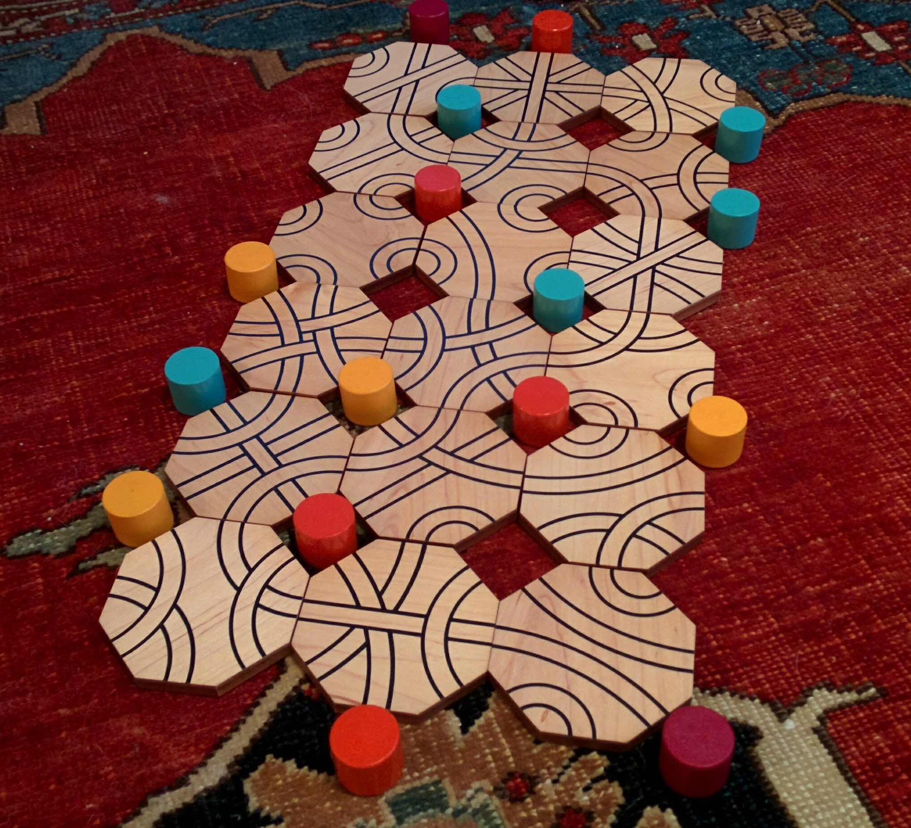

# Turn-based Strategy Game - October 2017

**Category:** Visual Puzzle / Logic
**URL:** https://www.janestreet.com/puzzles/turn-based-strategy-game-index/

## Problem Statement

The image shows a set of octagonal tiles arranged in a 6x3 grid. Each tile has curved lines connecting points on its edges, and colored pegs (red, blue, orange/yellow, cyan) are placed at various connection points between tiles.

Your task is to rotate the tiles so that each group of similarly colored pegs becomes connected by the curved lines on the tiles. Tiles can be rotated in one-eighth turn increments.

The answer to this puzzle is the name of a turn-based strategy game. The rotation values encode the answer through a clever mechanism.

**Image:**

