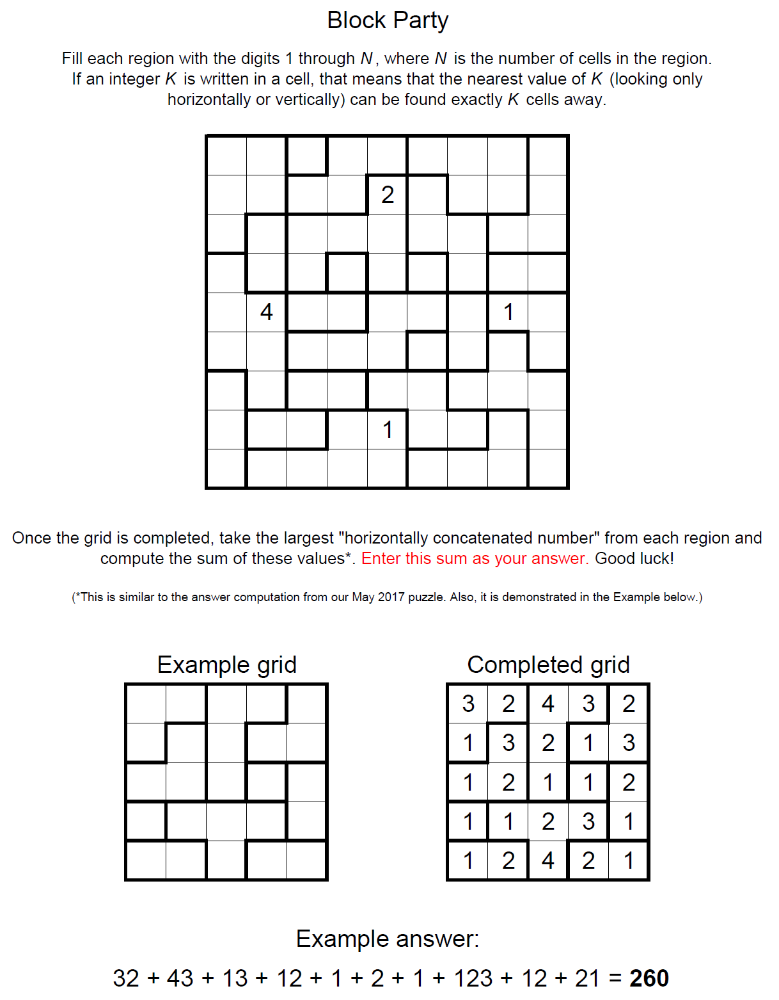

# Block Party - November 2017

**Category:** Grid Puzzle
**URL:** https://www.janestreet.com/puzzles/block-party-index/

## Problem Statement

Fill each region with the digits 1 through N, where N is the number of cells in the region.

If an integer K is written in a cell, that means that the nearest value of K (looking only horizontally or vertically) can be found exactly K cells away.

Once the grid is completed, take the largest "horizontally concatenated number" from each region and compute the sum of these values.

**Enter this sum as your answer.**

*(This is similar to the answer computation from the May 2017 puzzle.)*

**Image:**

