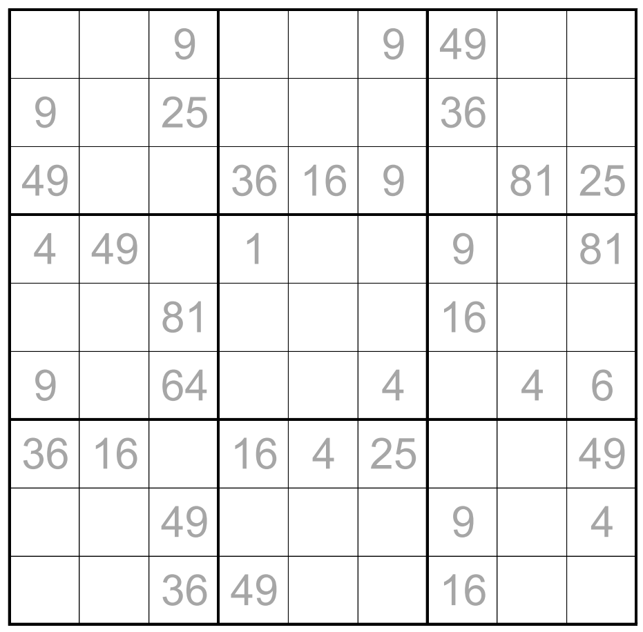

# Rather Square Sudoku - January 2018

**Category:** Sudoku Variant
**URL:** https://www.janestreet.com/puzzles/rather-square-sudoku-index/

## Problem Statement

Fill each cell in the grid — even the ones with grey numbers — with a digit between 1 and 9 so that each row, column, and outlined 3-by-3 region contains each digit once.

Each grey number shown below is equal to the **product** of 2 of the orthogonally adjacent cells in the completed grid.

**Answer:** The sum of the *squares* of the numbers that are written over the gray numbers in the completed grid.

**Image:**

