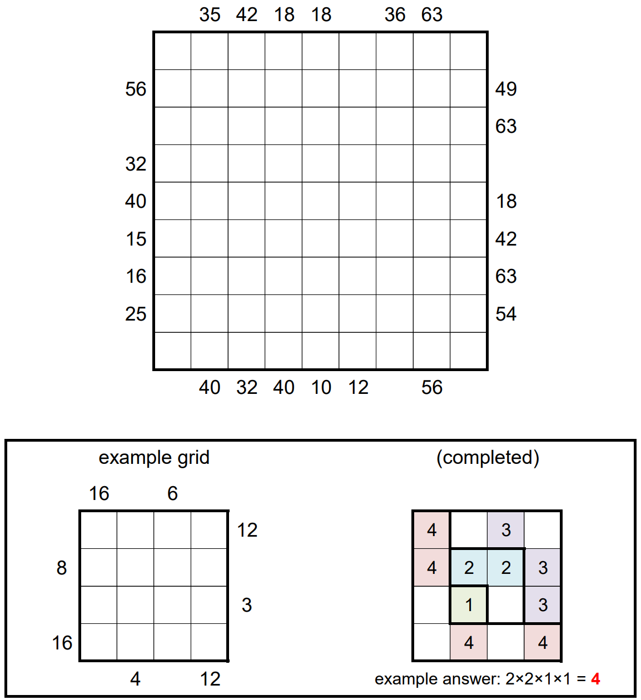

# Hooks 3 - February 2018

**Category:** Grid Puzzle
**URL:** https://www.janestreet.com/puzzles/hooks-3-index/

## Problem Statement

The grid can be partitioned into 9 L-shaped "hooks". The largest is 9-by-9 (contains 17 squares), the next largest is 8-by-8 (contains 15 squares), and so on. The smallest hook is just a single square.

Find where the hooks are located, and place nine 9's in the largest hook, eight 8's in the next-largest, etc., down to one 1 in the smallest hook.

**Rules:**
- The filled squares must form a connected region (orthogonally adjacent)
- Every 2-by-2 region must contain at least one unfilled square
- A number outside the grid indicates the product of the first 2 numbers visible from that row or column (so each row and column must have at least two filled squares)

**Answer:** The product of the areas of the connected groups of empty squares in the completed grid.

**Image:**

