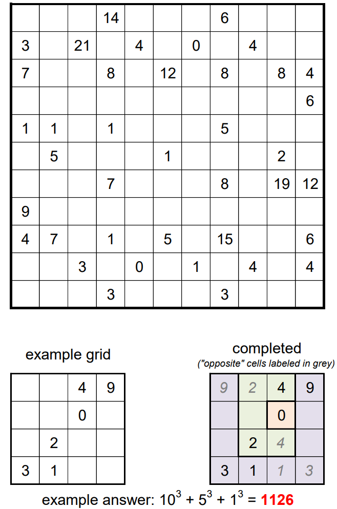

# It's Symmetric! - March 2018

**Category:** Grid Puzzle
**URL:** https://www.janestreet.com/puzzles/it-s-symmetric-index/

## Problem Statement

The grid can be partitioned into several regions, each of which is symmetric in some way (be it rotation or reflection).

A cell with a number indicates the length of the shortest walk, within that region, to an "opposite" cell in the region (i.e. a cell that could potentially be moved to the location of the numbered cell under a non-trivial rotation or reflection of the plane).

**Examples:**
- In a 1-by-N region, all cells could be labeled 0, since a reflection across the longer mid-line takes every cell to itself
- In the "S"-shaped Tetris piece, the cells could be labeled 3, 1, 1, 3

**Answer:** The sum of the cubes of the areas of the regions in the completed grid.

**Image:**

