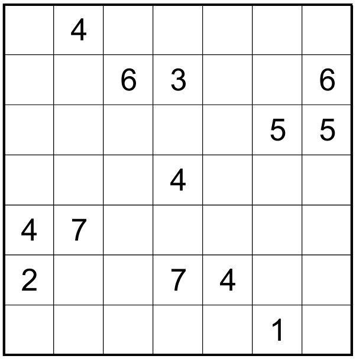

# Twenty Four Seven - June 2018

**Category:** Grid Puzzle
**URL:** https://www.janestreet.com/puzzles/twenty-four-seven-index/

## Problem Statement

The grid is incomplete. Place numbers in some of the empty cells so that in total the grid contains one 1, two 2's, etc., up to seven 7's.

**Rules:**
- Each row and column must contain exactly 4 numbers which sum to 20
- The numbered cells must form a connected region
- Every 2-by-2 subsquare must contain at least one empty cell

**Answer:** The product of the areas of the connected groups of orthogonally adjacent empty squares in the completed grid.

**Image:**

