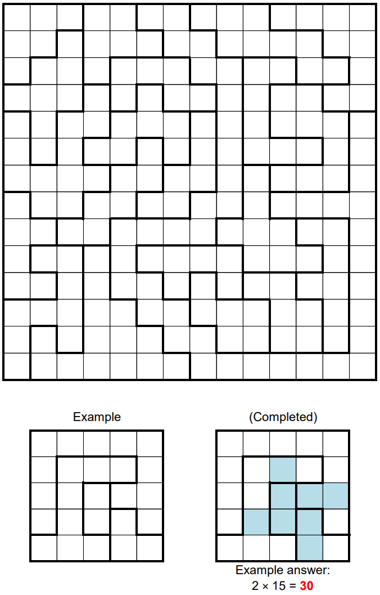

# Spiral Region - September 2018

**Category:** Grid Puzzle
**URL:** https://www.janestreet.com/puzzles/spiral-region-index/

## Problem Statement

Shade some cells in the grid above such that the set of shaded cells is connected, has 90-degree rotational symmetry about its center, and contains the same number of shaded cells in each outlined region.

**The answer to this puzzle is the smallest possible product of the areas of the connected groups of empty squares in the completed grid.**

**Image:**

