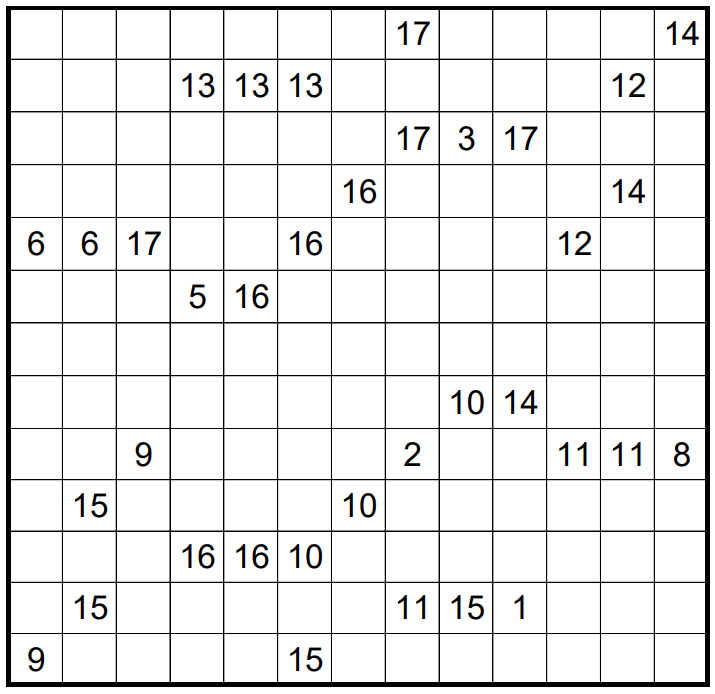

# Subtiles - October 2018

**Category:** Grid Puzzle
**URL:** https://www.janestreet.com/puzzles/subtiles-index/

## Problem Statement

Place an integer between 1 and 17 into some of the empty cells in the grid. When completed, the grid should have one 1, two 2's, etc., up to seventeen 17's.

For all *N* larger than 1, the squares marked *N* must form a connected *N*-omino whose shape "contains" the (*N*−1)-omino determined by the (*N*−1)'s. (Reflections and rotations are allowed.)

Some of the cells have already been labeled.

**Answer:** The product of the areas of the empty regions in the completed grid.

**Image:**

