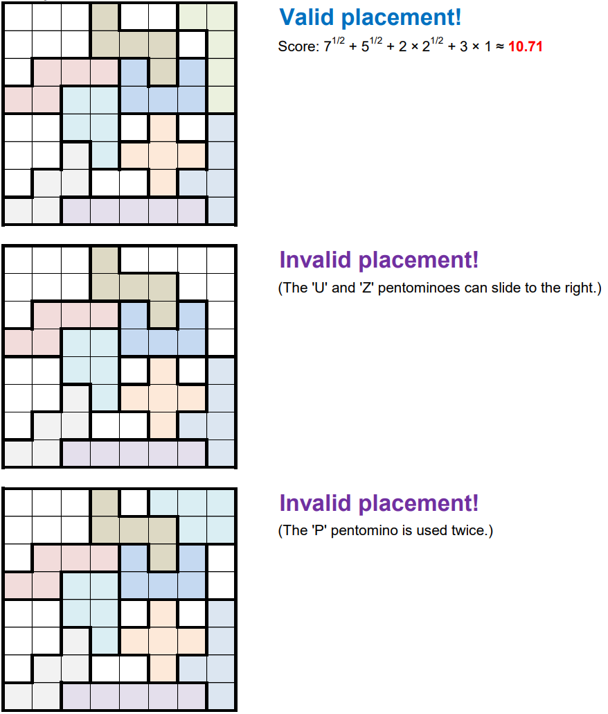

# 'Pent-up' Frustration - November 2018

**Category:** Grid Puzzle / Optimization
**URL:** https://www.janestreet.com/puzzles/pent-up-frustration-index/

## Problem Statement

Place as many distinct pentominoes as you want into an 8-by-8 grid, in such a way that the placement is "tight" — i.e., no piece(s) can freely slide around within the grid.

The score for a given placement is the **sum of the square roots of the areas of the empty regions** in the grid.

**Question:** What is the largest score you can obtain?

Use standard pentomino notation: F, I, L, N, P, T, U, V, W, X, Y, Z and "." for empty spaces.

**Image:**

