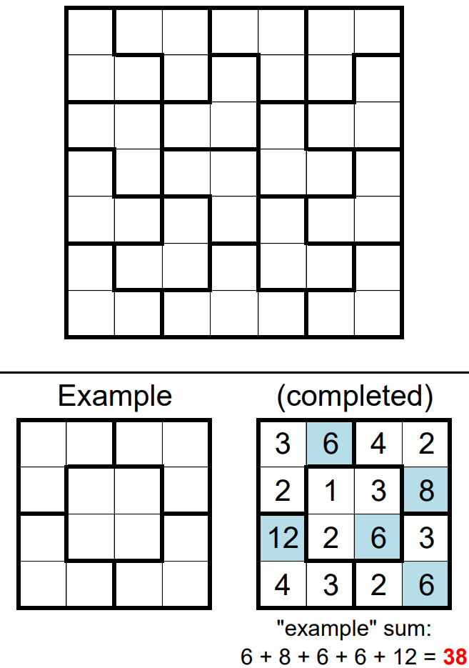

# Block Party 2 - December 2018

**Category:** Grid Puzzle
**URL:** https://www.janestreet.com/puzzles/block-party-2-index/

## Problem Statement

Fill each cell with a positive integer such that integers do not repeat within any row, column, or outlined region.

Within each region, one cell must be equal to the product of the other cells, and these "product" cells may not share edges with "product" cells from other regions.

**Answer:** The smallest possible sum for the "product" cells.

**Image:**

