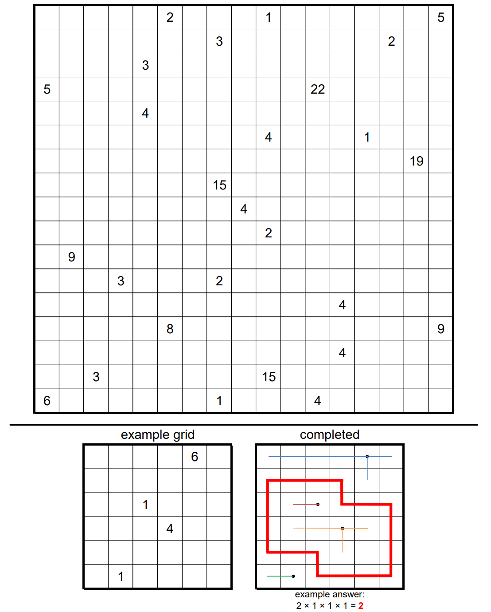

# Fences - January 2019

**Category:** Grid Puzzle
**URL:** https://www.janestreet.com/puzzles/fences-index/

## Problem Statement

A 17-by-17 field is divided into unit squares. Some of the squares contain "posts" at their center. Each post is represented by a number.

Construct one or more fences emanating from each post, such that the total length of fence connected to a post equals the number given. Fences have integer length and can only be constructed horizontally or vertically. Fences from different posts may not touch, nor may a fence from one post touch a different post.

The goal is to build your fences in such a manner that it is possible to draw a **closed loop** through some of the remaining empty squares. The loop must enclose at least one post, and must be **symmetric** in some way (either via rotation or reflection). The loop must be rectilinear, passing through the centers of adjacent empty squares.

**Answer:** The product of the fence-lengths of the fences **inside the loop**.

**Image:**

