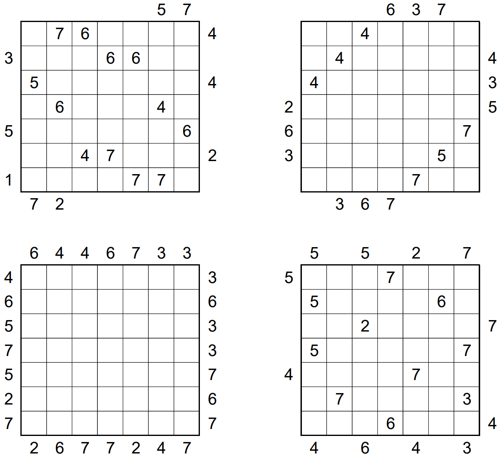

# Twenty Four Seven 2-by-2 - March 2019

**Category:** Grid Puzzle
**URL:** https://www.janestreet.com/puzzles/twenty-four-seven-2-by-2-index/

## Problem Statement

For each of four grids, place numbers in some of the empty cells so that in total the interiors of each grid contain one 1, two 2's, etc., up to 7's.

**Rules:**
- Each row and column must contain exactly 4 numbers which sum to 20
- The numbered cells must form a connected region
- Every 2-by-2 subsquare must contain at least one empty cell
- Numbers outside the grid indicate the first number "viewable" when looking into the grid

Once you have solved all four grids, compute their "sum" (the 7-by-7 grid that is the coordinatewise sum of the interiors of the four finished grids).

**Answer:** The sum of the squares of the 49 numbers in this "sum" grid.

**Image:**

