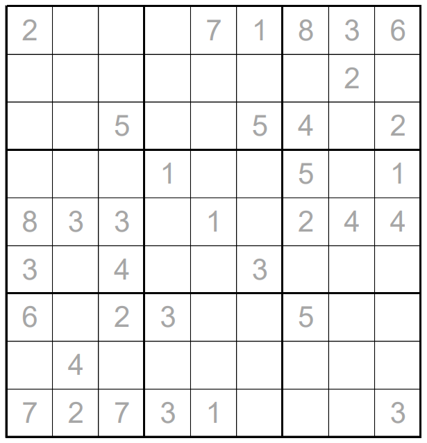

# Remote Sudoku - April 2019

**Category:** Sudoku Variant
**URL:** https://www.janestreet.com/puzzles/remote-sudoku-index/

## Problem Statement

Fill each cell — even the ones with grey numbers — with a digit between 1 and 9 so that each row, column, and outlined 3-by-3 squares contains each digit once.

A grey number **N** indicates that there is an **N** exactly **N** squares away (horizontally or vertically).

**Answer:** The sum of the squares of the numbers written over the gray numbers in the completed grid.

(For example, if a 7 is written over one of the grey numbers, that would contribute 49 towards the sum.)

**Image:**

