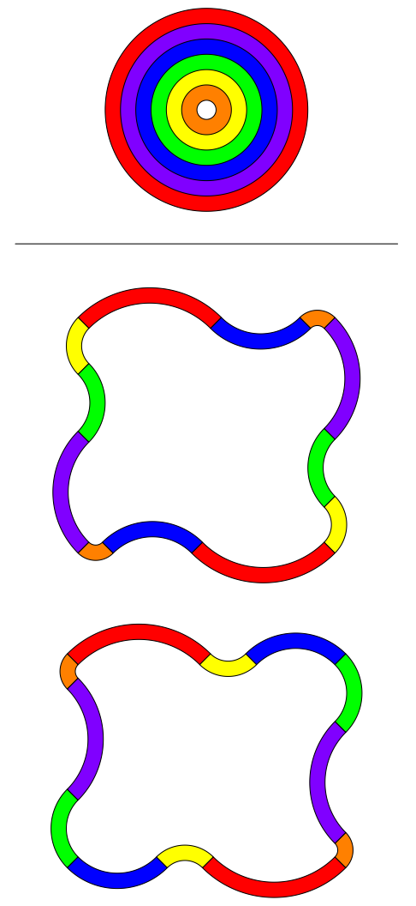

# Disassembled Rainbow Bagel - May 2019

**Category:** Geometry
**URL:** https://www.janestreet.com/puzzles/disassembled-rainbow-bagel-index/

## Problem Statement

Seven concentric circles, each of integer diameter, are used to determine six annuli. The annuli have a total area of 2019π.

The annuli are then cut into quarters, and these 24 quarter-annuli are rearranged to form two loops.

**Question:** What is the **difference** between the enclosed areas of the two loops?

**Image:**

