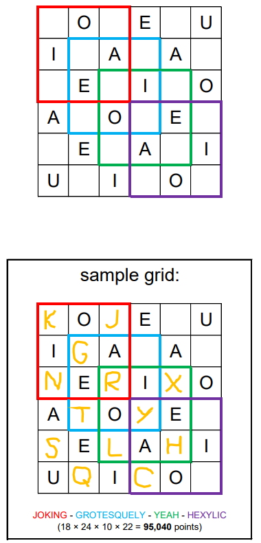

# Scraggle - July 2019

**Category:** Word Puzzle
**URL:** https://www.janestreet.com/puzzles/scraggle-index/

## Problem Statement

Place **distinct** consonants (allowing Y) into some or all of the empty squares of the 6-by-6 grid (vowels are pre-placed) so that you can form a **4-word chain**.

- The first word must start and end inside the red outlined region
- The second, third, and fourth words must start and end inside the blue, green, and purple outlined regions
- The last letter of each word must be the first letter of the next word

Words are formed by making king's moves between squares. Squares may be revisited within a word. Words must be legal English-language SCRABBLE® words.

The score for your chain is the **product** of the SCRABBLE® point values of your four words.

**Image:**

