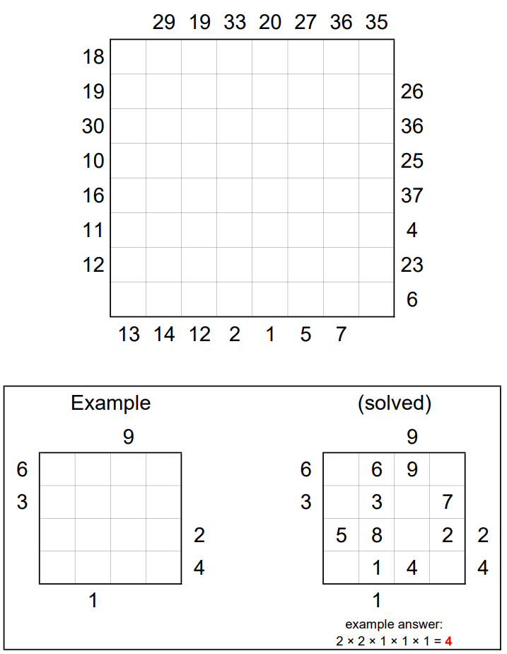

# Knight Moves 3 - August 2019

**Category:** Grid Puzzle
**URL:** https://www.janestreet.com/puzzles/knight-moves-3-index/

## Problem Statement

Place the numbers 1, 2,…, *N* (for some *N*) on a subset of the squares, so that it is possible for a knight to move from 1 to *N* via a series of legal knight's moves. Each number **inside** the grid represents the height of a building located at that square, and we can think of the knight as jumping from rooftop to rooftop on this series of incrementally taller buildings.

A number **outside** the grid indicates the first (i.e. smallest) number for which the knight was visible looking into the grid in the direction of that row or column.

**Answer:** The smallest achievable product of the areas of the connected groups of empty squares in the completed grid.

**Image:**

