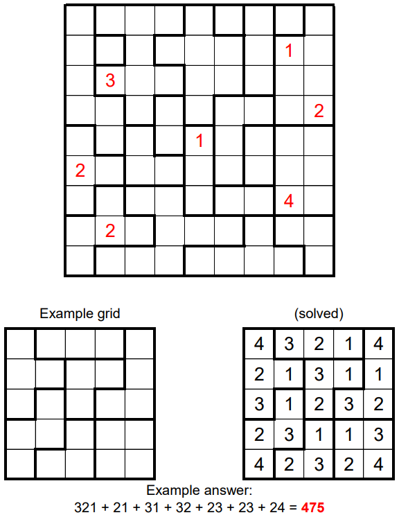

# Block Party 3 - September 2019

**Category:** Grid Puzzle
**URL:** https://www.janestreet.com/puzzles/block-party-3-index/

## Problem Statement

Fill each region with the digits 1 through *N*, where *N* is the number of cells in the given region. For every cell in the grid, if *K* denotes the number in that cell, then the nearest value of *K* (looking only horizontally or vertically) must be located **exactly** *K* cells away.

Some of the cells have already been filled in.

**Answer:** Once the grid is completed, take the largest "horizontally concatenated number" from each region and compute the sum of these values.

**Image:**

