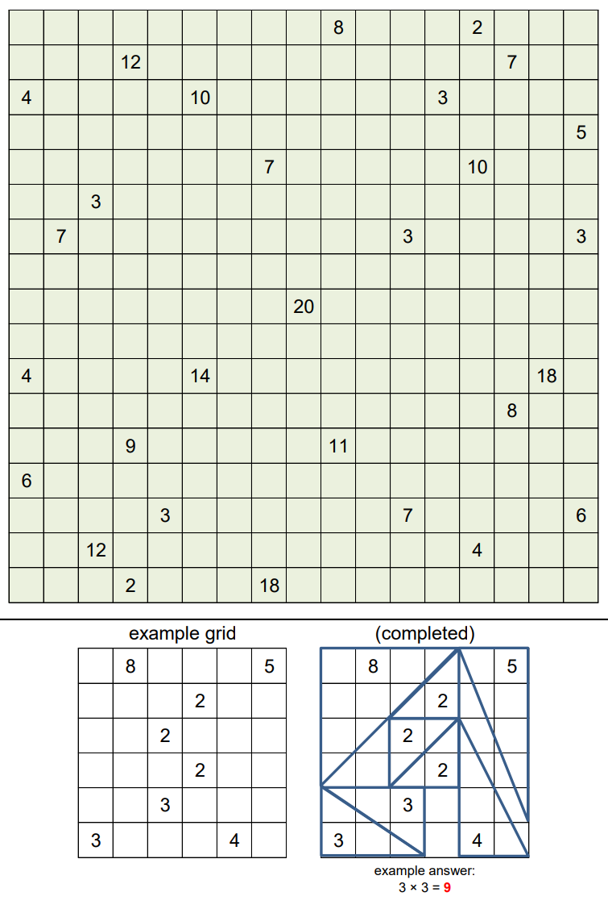

# Tri, Tri Again, Again - October 2019

**Category:** Grid Puzzle
**URL:** https://www.janestreet.com/puzzles/tri-tri-again-again-index/

## Problem Statement

Place a collection of right triangles into the grid. The triangles must have integer-length legs, and the legs must be along grid lines.

Each triangle must contain exactly one number. That number represents the **area** of the triangle containing it. (Every number must eventually be contained in exactly one triangle.) The entire square (1-by-1 cell) containing the number must be inside the triangle.

Triangles' interiors may not overlap. (But triangles' boundaries may intersect.)

**Answer:** The product of the **odd horizontal leg** lengths.

**Image:**

