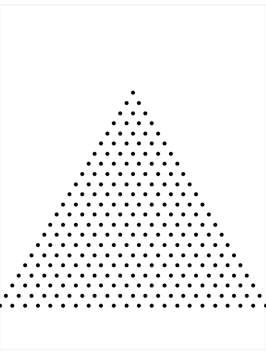

# Triads - April 2020

**Category:** Combinatorics
**URL:** https://www.janestreet.com/puzzles/triads-index/

## Problem Statement

Consider an equilateral triangular grid of dots with N rows. A "triad" is a set of 3 dots where each dot in the triad borders the other two. The top two rows of the triangular grid form a triad; all triads are (rotations of) precisely this shape.

For some values of N, it is possible to separate the triangular grid into disjoint triads such that every dot is a part of one triad. For example, it is obviously possible when N=2, but not when N=3 or N=4.

**Question:** What is the sum of all values of N < 40 for which it is possible?

**Image:**

