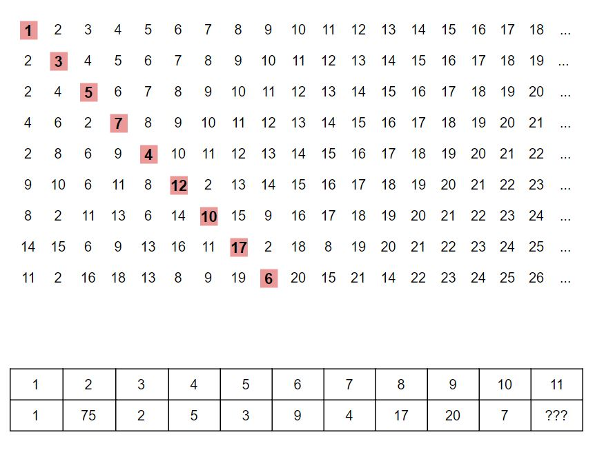

# Expelled - May 2020

**Category:** Number Puzzle
**URL:** https://www.janestreet.com/puzzles/expelled-index/

## Problem Statement

One number is expelled in each row. The nth number in the nth row of the grid is expelled, and does not appear in any future rows.

In each successive row, the numbers are re-ordered. Starting at the expelled number in row n-1, row n is generated by writing the numbers positioned (-1,1,-2,2,-3,3,-4,4,…) away from the expelled number, as long as they exist, where negative numbers mean "to the left" and positive numbers mean "to the right."

**Image:**

