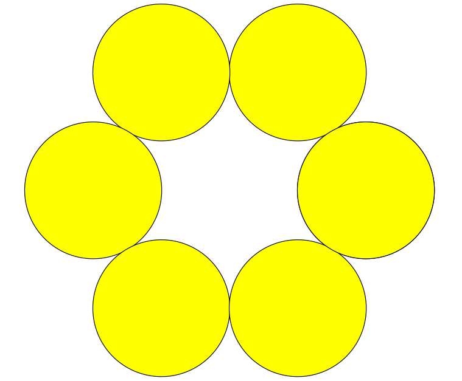

# Circle Time - June 2020

**Category:** Geometry
**URL:** https://www.janestreet.com/puzzles/circle-time-index/

## Problem Statement

Call a "ring" of circles a collection of six circles of equal radius, say r, whose centers lie on the six vertices of a regular hexagon with side length 2r. This makes each circle tangent to its two neighbors, and we can call the center of the regular hexagon the "center" of the ring of circles.

If we are given a circle *C*, what is the maximum proportion of the area of that circle we can cover with rings of circles entirely contained within *C* that all are mutually disjoint and share the same center?

**Answer format:** A closed-form solution, or your answer out to 6 decimal places.

**Image:**

