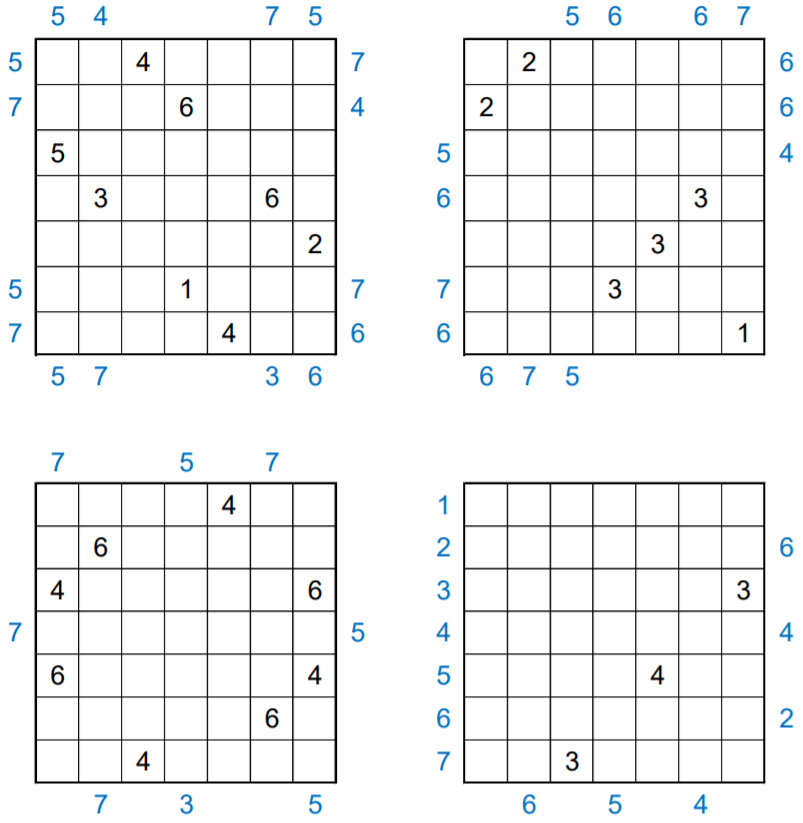

# Twenty Four Seven 2-by-2 #2 - December 2020

**Category:** Grid Puzzle
**URL:** https://www.janestreet.com/puzzles/twenty-four-seven-2-by-2-2-index/

## Problem Statement

Each of the grids is incomplete. Place numbers in some of the empty cells so that in total each grid's interior contains one 1, two 2's, etc., up to seven 7's.

**Rules:**
- Each row and column within each grid must contain exactly 4 numbers which sum to 20
- The numbered cells must form a connected region
- Every 2-by-2 subsquare in the completed grid must contain at least one empty cell

Some numbers have been placed inside each grid. Additionally, some blue numbers have been placed outside of the grids. These blue numbers indicate the first value seen in the corresponding row or column when looking into the grid from that location.

Once each of the grids is complete, create a 7-by-7 grid by "adding" the four grids' interiors together (as if they were 7-by-7 matrices).

**Answer:** The sum of the **squares** of the values in this final grid.

**Image:**

