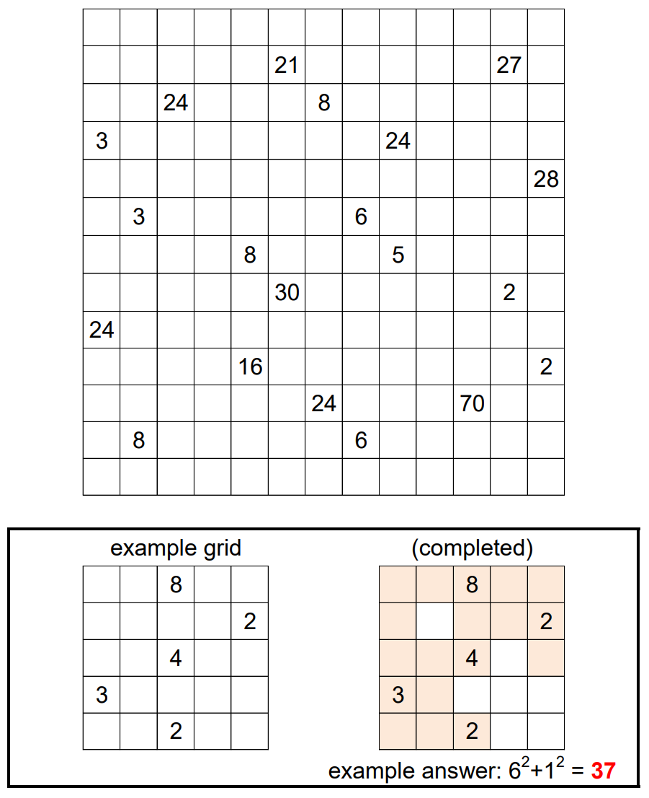

# It's Symmetric 2 - July 2021

**Category:** Grid Puzzle
**URL:** https://www.janestreet.com/puzzles/it-s-symmetric-2-index/

## Problem Statement

Shade some of the cells in the grid so that the region of shaded cells is connected and symmetric in some way (either by rotation or reflection).

Some of the cells have been numbered. These cells are in the shaded region, and the numbers denote the products of the number of shaded cells one can "see" within the region, in each of the 4 cardinal directions, before encountering an unshaded cell.

**Answer:** The sum of the squares of the areas of connected unshaded squares in the completed grid. (Squares are "connected" if they are orthogonally adjacent.)

**Image:**

