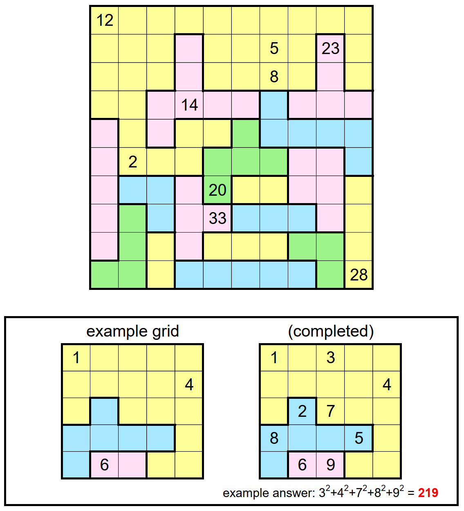

# Knight Moves 4 - September 2021

**Category:** Grid Puzzle
**URL:** https://www.janestreet.com/puzzles/knight-moves-4-index/

## Problem Statement

A knight was initially located in a square labeled 1. It then proceeded to make a series of moves, never re-visiting a square, and labeled the visited squares in order. When the knight was finished, the labeled squares in each region of connected squares had the same sum.

A short while later, many of the labels were erased. The remaining labels can be seen in the grid.

Complete the grid by re-entering the missing labels.

**Answer:** The sum of the *squares* of the largest label in each row of the completed grid.

**Image:**

