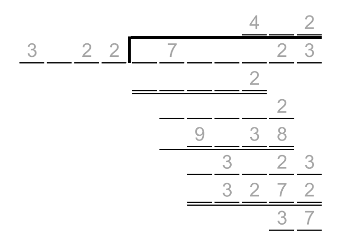

# Split Division 2 - November 2021

**Category:** Number Puzzle
**URL:** https://www.janestreet.com/puzzles/split-division-2-index/

## Problem Statement

Two long division problems were calculated, and both problems had the exact same shape. At some places, the digits from the two problems were both positive and had a greatest common divisor that was larger than 1. **All** of those spots are marked with their respective GCDs.

**Answer:** The sum of the two 7-digit dividends in the completed long division problems.

**Image:**

