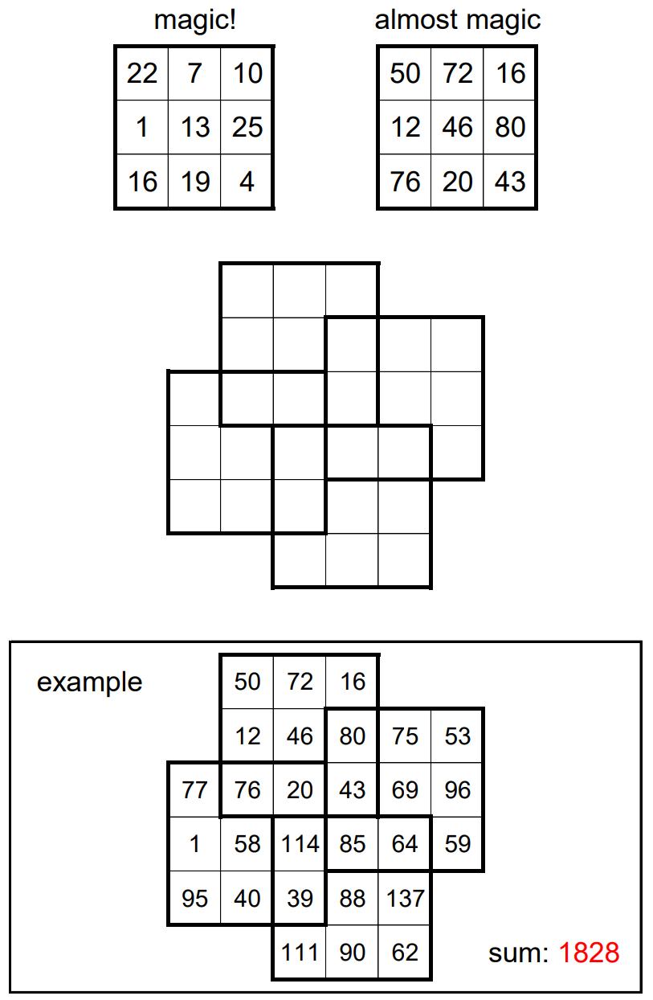

# Almost Magic - April 2022

**Category:** Grid Puzzle / Optimization
**URL:** https://www.janestreet.com/puzzles/almost-magic-index/

## Problem Statement

For the purposes of this puzzle, define a **magic square** to be a 3-by-3 grid of positive integers for which the rows, columns, and two diagonals all have the same sum.

An **almost magic square** is, well, *almost* a magic square. It differs from a magic square in that the 8 sums may differ from each other by at most 1.

Place *distinct* positive integers into the grid such that each of four bold-outlined 3-by-3 regions is an almost magic square. Your goal is to do so in a way that *minimizes* the overall sum of the integers you use.

**Answer format:** Submit a comma-separated list of the 28 integers in your diagram in top-to-bottom order.

**Image:**

