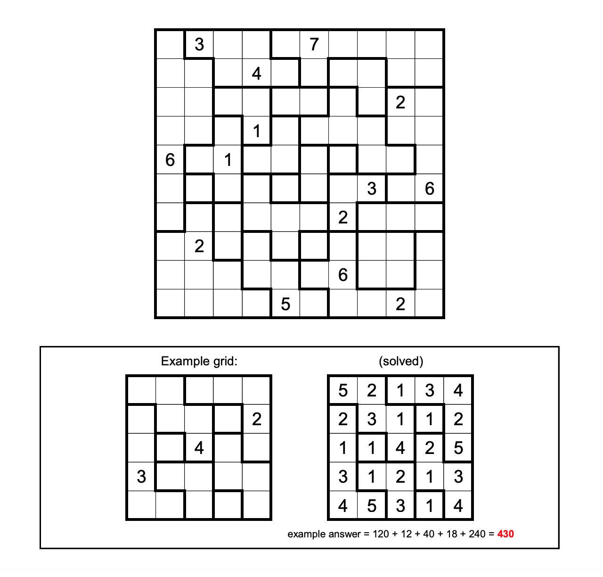

# Block Party 4 - June 2022

**Category:** Grid Puzzle
**URL:** https://www.janestreet.com/puzzles/block-party-4-index/

## Problem Statement

Fill each region with the numbers 1 through *N*, where *N* is the number of cells in the region. For each number *K* in the grid, the nearest *K* **via taxicab distance** must be exactly *K* cells away.

**Answer:** Once the grid is completed, compute the product of the values in each row, and then take the sum of these products.

**Image:**

