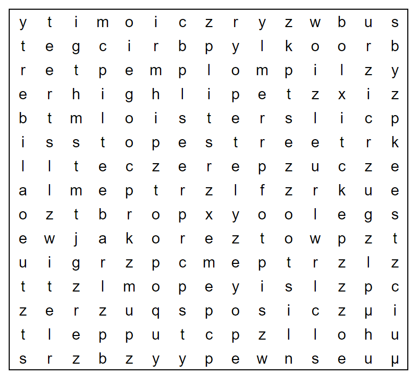

# New York Minute - August 2022

**Category:** Word Puzzle
**URL:** https://www.janestreet.com/puzzles/new-york-minute-index/

## Problem Statement

The Jane Street Puzzle Master has twenty-three errands (don't worry, almost all of them are tiny!) that she needs to cross off her to-do list on her day off. If she can manage that small task, she plans to meet up with some friends tonight for a short while.

Can you figure out where they'll meet up, and why?

**Image:**

