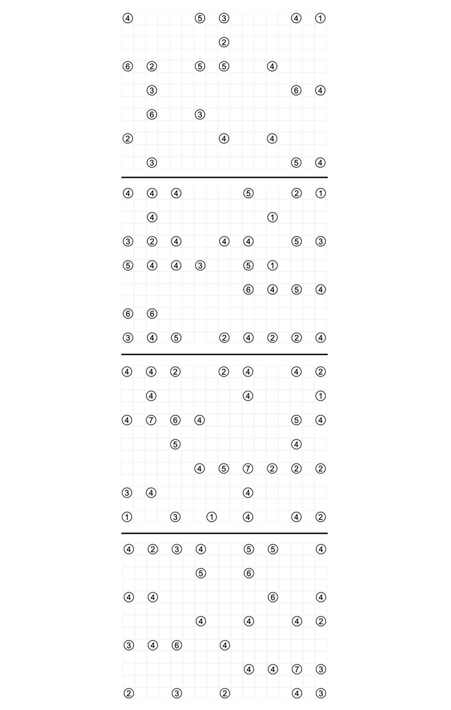

# The Marshy Mess - October 2022

**Category:** Grid Puzzle / Probability
**URL:** https://www.janestreet.com/puzzles/the-marshy-mess-index/

## Problem Statement

You've ventured warily into Puzzle Forest, and as you round a bend you see a rickety bridge crossing a stream into a swampy area up ahead. Papers with line diagrams and decks of playing cards are strewn about next to the trail here. A grotesque monster climbs out from under the bridge!

"Oh have the faeries been telling stories about me again? I'm just Hashi, the poor old bridge troll of Puzzle Forest!"

"I'm not so bad, but I do need some help arranging the spans through the four swampy fields up ahead. Due to my trollish nature, each field has one island marked with the wrong number of bridges… sorry, I can't help myself! I have three friends coming over to play cards later and I would love to set up the spans and correct the wrong numbers before then!"

**Answer format:** A rational number between 0 and 1, accurate to 7 digits (or exactly in lowest terms).

**Image:**

