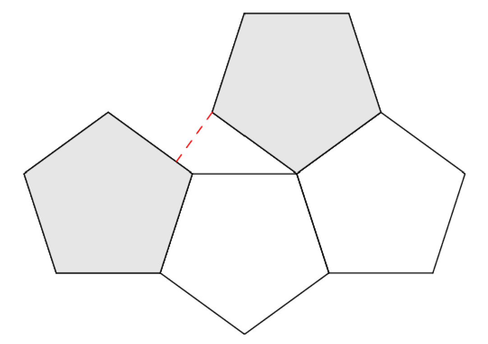

# 'Pent-up' Frustration 2 - November 2022

**Category:** Geometry / Optimization
**URL:** https://www.janestreet.com/puzzles/pent-up-frustration-2-index/

## Problem Statement

You have **seventeen** identical unit regular pentagonal tiles on a tabletop.

If you arrange them all into a single polyform (so each pentagon placed after the first shares a side with an already-placed pentagon, but no two pentagons overlap other than along their boundaries), what is the smallest nonzero distance you can create between two of the pentagons?

Here, the distance between pentagon *A* and pentagon *B* is the infimum of the set of distances between any point of *A* and any point of *B*.

**Answer format:** Rounded to seven decimal places.

**Example:** If you only had four pentagons the answer would be ~0.5877853.

**Image:**

