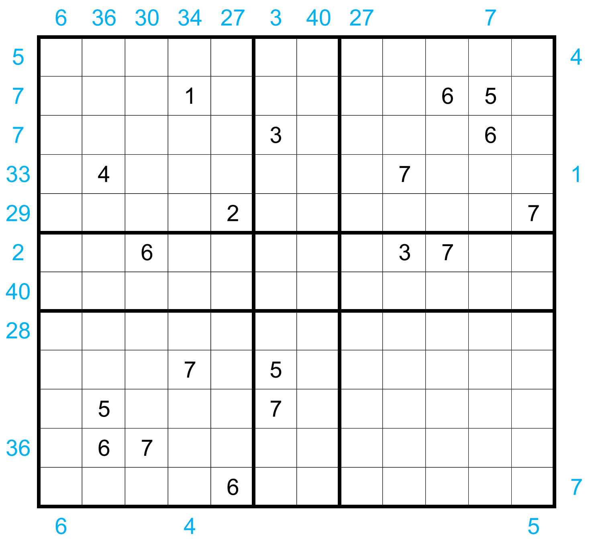

# Twenty Four Seven (Four-in-One) - February 2023

**Category:** Grid Puzzle
**URL:** https://www.janestreet.com/puzzles/twenty-four-seven-four-in-one-index/

## Problem Statement

Four "Twenty Four Seven" grids have been smooshified together within the 12-by-12 grid.

Place numbers in some of the empty cells so that in total each of the four 7-by-7 outlined grids is a legal "Twenty Four Seven" grid.

### Rules

- Each 7-by-7 grid's interior should contain one 1, two 2's, etc., up to seven 7's
- Each row and column within the 7-by-7's must contain exactly 4 numbers which sum to 20
- The numbered cells must form a connected region
- Every 2-by-2 subsquare in the completed grid must contain at least one empty cell

### Clues

Some numbers have been placed inside the grid. Additionally, some blue numbers have been placed *outside* the grid. A number outside the grid represents either the sum of the row or column it is facing, *or* the value of the first number it sees in that row or column.

**Answer:** The product of the areas of the connected groups of orthogonally adjacent empty squares in the grid.

**Image:**

